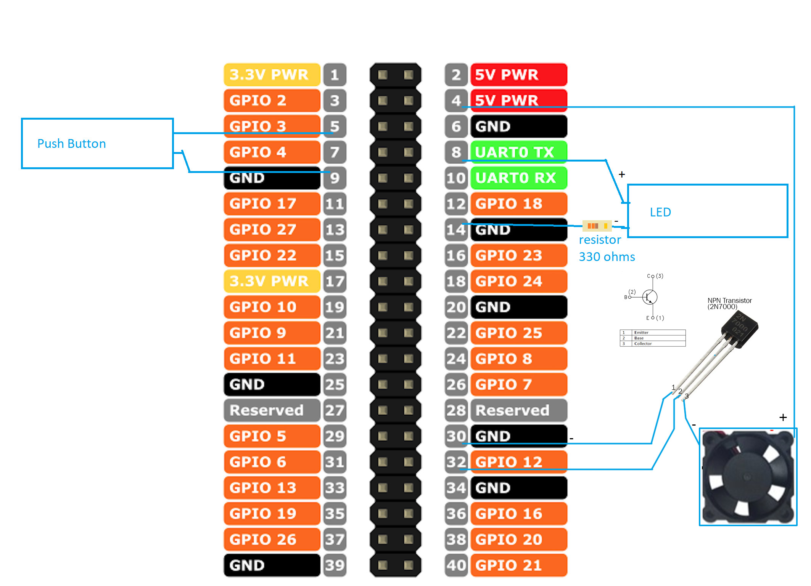

# Severino Pi (alpha version)


**Initial development is in progress. No releases yet.**

Access control with face recognition for Raspberry Pi.

* MIT License
* LGPDP Brasil Safe (Lei Geral de Proteção de Dados Pessoais)

## Background

This project is a Raspberry Pi port and refactoring from my [Face Access project](https://github.com/alexandremendoncaalvaro/face-access).  
This project is for Makers! People that love the concept of DIY (Do It Yourself).  
The idea is to make a very easy option to build an DIY access control with face recognition at your door.  

It´s MIT License. A short and simple permissive license with conditions only requiring preservation of copyright and license notices. Licensed works, modifications, and larger works may be distributed under different terms and without source code.  


Feel free to make a fork and contribute with the project upgrade and maintenance.  

So.. Don´t worry, be happy!

## Recomended requirements

### Hardware

* Raspberry Pi 3B+ or above
* Compatible class 10 [SD Card](https://www.raspberrypi.org/documentation/installation/sd-cards.md) with 16GB or above
* Raspberry Pi Camera Module
* Raspberry Pi LCD Screen (optional)
* Raspberry Pi official font or USB Charger (at least 3A current) and USB Type-A to micro-USB cable (the most common found on smartphones)
* Monitor ²
* HDMI cable ²
* Solenoid Door lock
* 5V Relay module
* 12VDC Power source
* Push-button (with or without LED)³

>¹Unlike USB webcam, the Camera module is connected directly to the Raspberry Pi GPU  
²At least for the configuration process  
³If your button have LED use a resistor to drop-down current  
Use this to calculate the resistor value: https://www.hobby-hour.com/electronics/ledcalc.php

### Raspberry Pi software and O.S.

* Raspbian Buster or above
* Python 3.8 or above

### Do I really need an extra computer?

**Short answer: Yes, you will do.**  
First, to configure the SD Card for the first run of Raspberry Pi.  
After that, you will want to enclosure the hardware for installation, and the idea of remove the SD card, or connect cables every time that you need to do a configuration change is a nightmare.  
So, I strongly recommend that you use an extra computer to handle Raspberry Pi remotely.

### Computer Software

* Supported [SSH Client](https://code.visualstudio.com/docs/remote/troubleshooting#_installing-a-supported-ssh-client)
* [VS Code](https://code.visualstudio.com/download)
* The fantastic VS Code plugin: [Remote - SSH](https://marketplace.visualstudio.com/items?itemName=ms-vscode-remote.remote-ssh)  
* X11 Forwarding tool
  * MacOS
    * [XQuartz](https://www.xquartz.org/)
  * Windows
    * [MobaxTerm](https://mobaxterm.mobatek.net/)
  * Linux
    * Native

>Tested on Windows 10, Ubuntu 20.04 LTS and MacOS X Mojave.

# Install

To start, on Raspberry Pi connect only the camera module.  


## Raspbian

  
Use Raspberry Pi Imager for an easy way to install Raspbian and other operating systems to an SD card ready to use with your Raspberry Pi:

* [Raspberry Pi Imager for Windows](https://downloads.raspberrypi.org/imager/imager.exe)
* [Raspberry Pi Imager for macOS](https://downloads.raspberrypi.org/imager/imager.dmg)
* [Raspberry Pi Imager for Ubuntu](https://downloads.raspberrypi.org/imager/imager_amd64.deb)

Connect an SD card reader with the SD card inside.  
Open Raspberry Pi Imager and choose Raspibian(recomended) from the OS list presented.  
Choose the SD card you wish to write your image to.  
Review your selections and click 'WRITE' to begin writing data to the SD card.  
>Note: if using the Raspberry Pi Imager on Windows 10 with Controlled Folder Access enabled, you will need to explicitly allow the Raspberry Pi Imager permission to write the SD card. If this is not done, the Raspberry Pi Imager will fail with a "failed to write" error.

  
Connect the Raspberry Pi to the monitor using the HDMI cable.  
Insert the SD card into the Raspberry Pi and power it up with the micro-USB input.  
If you need to manually log in, the default user name is **pi**, with password **raspberry**. Remember the default keyboard layout is set to UK.  
You should change the default password straight away to ensure your Raspberry Pi is secure.  
Follow the steps on the screen to configure Raspberry Pi for the first use.  
It´s important to configure Wifi or Ethernet in the same network of your computer.

### Enable Raspberry Pi Features

On your Raspberry Pi, choose Menu > Preferences > Raspberry Pi Configuration.  
Click on Interfaces and set Camera and SSH to Enabled. Click OK. You don’t need to restart your Raspberry Pi, and SSH will be enabled whenever you use that installation of Raspbian from that point on.


>more about SSH on Raspberry at [Magpi](https://magpi.raspberrypi.org/articles/ssh-remote-control-raspberry-pi)

Press Ctrl + Shift + T to open the Terminal and use the command bellow to check Raspberry Pi IP address:

```bash
ip a
```

In my case it´s connected by Wifi, and returns:


>Take note of the address of your connected interface.

## Remote Control

You have several options to control your Raspberry Pi remotely, like a simple [VNC access](https://www.raspberrypi.org/documentation/remote-access/vnc/).  
But with this aproach all of your environment features needs to be installed on Raspberry Pi, and it's expend a lot of resources of Raspberry Pi.  

So, let's keep all enviroment features on your computer and only install the resources to run the application on your Raspberry Pi.

## Integrated Development Enviroment (IDE)

  
>Please check carefully and install all the [Computer Software recomended requirements](#computer-software).

### Recommended Terminal

The [Remote - SSH extension](https://marketplace.visualstudio.com/items?itemName=ms-vscode-remote.remote-ssh) does not currently enable X11 forwarding in VSCode Terminal witch is necessary to see graphical resources on your computer. (see [issue #267](https://github.com/microsoft/vscode-remote-release/issues/267)).  
So we are going to use recommended terminal and X11 Forwarding app for each Operational System:

* Linux: System Terminal (Native resource)
* MacOS: System Terminal with [XQuartz](https://www.xquartz.org/)
* Windows: [MobaxTerm](https://mobaxterm.mobatek.net/) (Very powerfull and easy)

### SSH Connection

> Remember to run the X11 Forwarding Server In MacOS (XQuartz) before connect.

Open the [recommended terminal](#recommended-terminal) and verify you can connect to the SSH host by running the following command replacing IP address as appropriate:

```bash
ssh -Y pi@192.168.0.42
```

### File Transfer

You can tranfer files using the SCP command like this example, replacing parameters as appropriate ([more details here](https://linuxize.com/post/how-to-use-scp-command-to-securely-transfer-files)):  

```bash
scp file.txt pi@192.168.0.42:/remote/directory
```

> In Windows you can use MobaXterm Visual Interface

In VS Code select Remote-SSH: Connect to Host... from the Command Palette (F1) and use the same pi@ipaddress as in last step.


After a moment, VS Code will connect to the SSH server and set itself up.  
After you are connected, you'll be in an empty window. You can always refer to the Status bar to see which host you are connected to.


You can then open any folder or workspace on the remote machine using File > Open... or File > Open Workspace... just as you would locally!

  

## Install OpenCV and Dlib
### About PIPENV

We´re going to use PIPENV.  
This great tool brings python virtual environment and package management to another level.  

To know more access: https://github.com/pypa/pipenv

### IMPORTANT
EVERY TIME you open a new terminal to run a python file you will need to enable pipenv resources at the terminal.  
To enable an installed pipenv enviroment, navigate to the project folder (the one with Pipfile) and run:  

```bash
pipenv shell
```

To install new PIP libraries use pipenv instead of pip, like:

```bash
pipenv install numpy
```

## Two commands installation

 OpenCV and Dlib installation is very tricky. But, I've create a script to automate the process, and you will need only two commands and a lot of pacience.  

 If you want to check what is under the hood: [Here is the open source code](https://github.com/alexandremendoncaalvaro/install-opencv-dlib-raspbian)

1) Navigate to YOUR PYTHON PROJECT FOLDER in Raspbian Terminal, then run:

>If you don´t have a project folder, just create a new folder and navigate to it

```bash
/bin/bash -c "$(curl -fsSL https://raw.githubusercontent.com/alexandremendoncaalvaro/install-opencv-dlib-raspbian/master/easy-install.sh)"
```
>In the end it will reboot to command line interface

2) Run:

```bash
~/install-opencv-dlib-raspbian/easy-install-after-reboot.sh
```
>In the end it will reboot to desktop interface

*Do exercises, take a shower, take a nap... It´ll take a while, actually hours...  
  

## Testing OpenCV

in Raspbian Terminal or Remote Terminal with SSH and X11 Forwarding:

```bash
~/install-opencv-dlib-raspbian/test-opencv.sh
```

>It will test for python 2 and 3 and will open a grayscale window for each test.

## Testing DLIB

in Raspbian Terminal or Remote Terminal with SSH and X11 Forwarding:

```bash
~/install-opencv-dlib-raspbian/test-dlib.sh
```

then:

```bash
cd ~/install-opencv-dlib-raspbian && python ~/install-opencv-dlib-raspbian/test-dlib.py
```

# Equipment Build
## Soft power button
Like ATX Power supply purpose on PCs, we need to avoid corrupted or lost data when turning off devices with embedded operating system environments.
So, this is a simple way to install and use a similar resource for Raspberry Pi with Raspbian.  

I've create a script to automate the configuration.  
If you want to check what is under the hood: [Here is the open source code](https://github.com/alexandremendoncaalvaro/soft-power-button-raspberry)

### Hardware connection
  
>In my specific case the resistor needed was 330 Ω

### Soft power button System Configuration
  
* Run in Raspberry Pi Terminal:
```bash
/bin/bash -c "$(curl -fsSL https://raw.githubusercontent.com/alexandremendoncaalvaro/soft-power-button-raspberry/master/install.sh)"
```
* Reboot Raspberry Pi
* Done!

### Soft power button usage
Like in modern PCs, just press the power button to turn it on or off.

# Using the system
UNDER CONSTRUCTION
## Handling users
UNDER CONSTRUCTION

## Are you a native english speaker?
No, I am not. If you find typos, grammar errors or whatever please feel free to PR or tell me.
