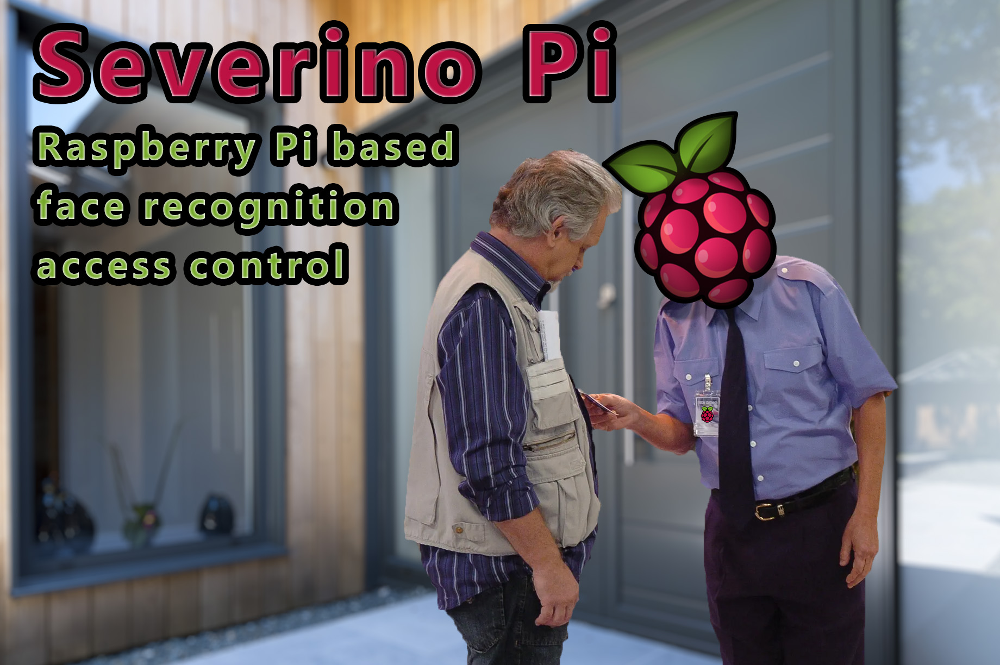
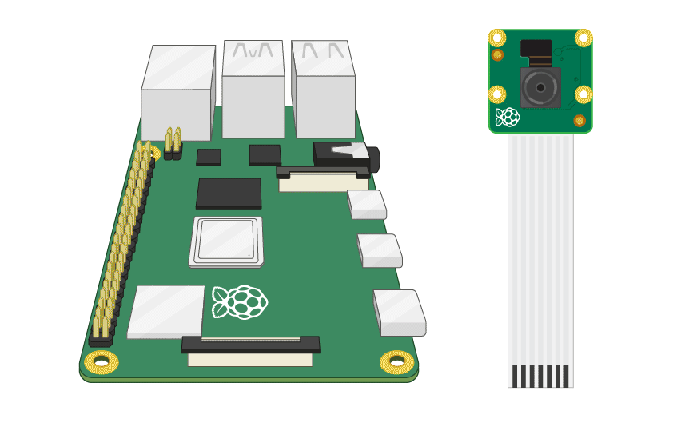

# Severino Pi (alpha version)
**Initial development is in progress. No releases yet.**

Access control with face recognition for Raspberry Pi.

* MIT License
* LGPD/ GDPR Safe*

> *No sensitive data or image stored to do the facial recognition process. It uses image extracted features instead.

## Background

This project is a Raspberry Pi port and refactoring from my [Face Access project](https://github.com/alexandremendoncaalvaro/face-access).  
This project is for Makers! People that love the concept of DIY (Do It Yourself).  
The idea is to make an easy option to build an DIY access control with face recognition at your door.  


## MIT License
It´s MIT License. A short and simple permissive license with conditions only requiring preservation of copyright and license notices. Licensed works, modifications, and larger works may be distributed under different terms and without source code.  


Feel free to make a fork and contribute with the project upgrade and maintenance.  

So.. Don´t worry, be happy!

# Table of contents

- [Severino Pi (alpha version)](#severino-pi-alpha-version)
  * [Background](#background)
  * [MIT License](#mit-license)
- [Table of contents](#table-of-contents)
- [Recommended requirements](#recommended-requirements)
  * [Hardware](#hardware)
    + [My Raspberry Pi case](#my-raspberry-pi-case)
  * [Raspberry Pi software and O.S.](#raspberry-pi-software-and-os)
  * [Do I really need an extra computer?](#do-i-really-need-an-extra-computer)
  * [Computer Software](#computer-software)
- [O.S. Install + Basic Configuration](#os-install-basic-configuration)
  * [Raspberry Pi OS](#raspberry-pi-os)
  * [Enable Raspberry Pi Features](#enable-raspberry-pi-features)
- [Checking the PiCamera](#checking-the-picamera)
- [Severino Pi System Install](#severino-pi-system-install)
  * [Repository clone](#repository-clone)
  * [Python Virtual Environment](#python-virtual-environment)
  * [Install OpenCV, Dlib, Facial Recognition and other libraries](#install-opencv-dlib-facial-recognition-and-other-libraries)
    + [OpenCV Build Easy!](#opencv-build-easy)
    + [Test OpenCV and Dlib](#test-opencv-and-dlib)
- [Equipment Build](#equipment-build)
  * [Hardware GPIO connection](#hardware-gpio-connection)
  * [Soft power button](#soft-power-button)
    + [Soft power button System Configuration](#soft-power-button-system-configuration)
    + [Soft power button usage](#soft-power-button-usage)
  * [FAN Cooling](#fan-cooling)
  * [HDMI 7 inch LCD Display](#hdmi-7-inch-lcd-display)
- [Using SeverinoPi System](#using-severinopi-system)
  * [User Management](#user-management)
- [Raspberry Pi remote use tips](#raspberry-pi-remote-use-tips)
  * [Get Raspberry Pi IP Address](#get-raspberry-pi-ip-address)
  * [Integrated Development Environment (IDE)](#integrated-development-environment-ide)
  * [Recommended Terminal](#recommended-terminal)
  * [SSH Connection](#ssh-connection)
  * [Transfer Files](#transfer-files)
- [Test PiCamera with OpenCV remotely](#test-picamera-with-opencv-remotely)
- [OpenCV Build References](#opencv-build-references)

# Recommended requirements
## Hardware

* Raspberry Pi
  * Raspberry Pi 3B+ or above
  * Compatible class 10 [SD Card](https://www.raspberrypi.org/documentation/installation/sd-cards.md) with 32GB or above
  * Raspberry Pi Camera Module
  * Raspberry Pi official charger
    * Or a 5V DC USB Charger (at least 3A) + USB Type-A to micro-USB cable
* Configuration ²
  * microSD to USB reader or equivalent
  * HDMI Monitor
  * HDMI cable
  * USB Mouse
  * USB Keyboard
* Door Lock
  * 12V DC Solenoid Door lock + Power source
  * 5V DC Relay module
* Extra Features
  * Push-button (with or without LED)³
  * Raspberry Pi LCD Screen (recommended, but you can use a HDMI monitor instead)⁴
  * DIY Case for Raspberry, Camera, LCD, Power Button

>¹Unlike USB webcam, the Camera module is connected directly to the Raspberry Pi GPU  
²At least for the first configuration process  
³If your button have LED use a resistor to drop-down current use this to calculate the resistor value: https://www.hobby-hour.com/electronics/ledcalc.php  
⁴My HDMI LCD model is 7 inches 800x480px  

### My Raspberry Pi case  
I drew a Raspberry Pi case for a freelance job, so I used a spare one for this project.  
I cannot provide the schematics for this case, because it's property of the client. But you can buy a plastic box and adapt it or something else... be creative.  

Some pictures of my DIY case for reference:  
  
  
  

## Raspberry Pi software and O.S.

* Raspberry Pi OS Buster or above
* Python 3.8 or above

## Do I really need an extra computer?

**Short answer: Yes, you will do.**  
First, to configure the SD Card for the first run of Raspberry Pi.  
After that, you will want to enclosure the hardware for installation, and the idea of remove the SD card, or connect cables every time that you need to do a configuration change is a nightmare.  
So, I strongly recommend that you use an extra computer to handle Raspberry Pi remotely.

## Computer Software

* Supported [SSH Client](https://code.visualstudio.com/docs/remote/troubleshooting#_installing-a-supported-ssh-client)
* [VS Code](https://code.visualstudio.com/download)
* [Remote - SSH](https://marketplace.visualstudio.com/items?itemName=ms-vscode-remote.remote-ssh) VS Code plugin  
* X11 Forwarding tool
  * MacOS
    * [XQuartz](https://www.xquartz.org/)
  * Windows
    * [MobaxTerm](https://mobaxterm.mobatek.net/)
  * Linux
    * Native

>Tested with Windows 10, Ubuntu 20.04 LTS and MacOS X Mojave.

# O.S. Install + Basic Configuration
## Raspberry Pi OS
To start, on Raspberry Pi connect only the camera module.  


  
Use Raspberry Pi Imager for an easy way to install Raspberry Pi OS and other operating systems to an SD card ready to use with your Raspberry Pi:

* [Raspberry Pi Imager](https://www.raspberrypi.com/software/)

Connect an SD card reader with the SD card inside.  
Open Raspberry Pi Imager and choose Raspberry Pi OS(recommended) from the OS list presented.  
Choose the SD card you wish to write your image to.  
Review your selections and click 'WRITE' to begin writing data to the SD card.  
>Note: if using the Raspberry Pi Imager on Windows 10 with Controlled Folder Access enabled, you will need to explicitly allow the Raspberry Pi Imager permission to write the SD card. If this is not done, the Raspberry Pi Imager will fail with a "failed to write" error.

  
Connect the Raspberry Pi to the monitor using the HDMI cable.  
Insert the SD card into the Raspberry Pi and power it up by connecting the charger input.  
If you need to manually log in, the default user name is **pi**, with password **raspberry**. Remember the default keyboard layout is set to UK.  
You should change the default password straight away to ensure your Raspberry Pi is secure.  
Follow the steps on the screen to configure Raspberry Pi for the first use.  
It´s important to configure WiFi or Ethernet in the same network of your computer.  

## Enable Raspberry Pi Features

On your Raspberry Pi, choose Menu > Preferences > Raspberry Pi Configuration.  
Click on Interfaces and set Camera and SSH to Enabled. Click OK.  
Restart your Raspberry Pi, camera and SSH will be enabled whenever you use that installation of Raspberry Pi OS from that point on.  


> *If the camera option is not available, use **sudo raspi-config** command from terminal and enable the Legacy Camera inside Interfaces option  
> *Read more about SSH on Raspberry at [Magpi](https://magpi.raspberrypi.org/articles/ssh-remote-control-raspberry-pi)  

# Checking the PiCamera
Now your Camera Module is connected and the software is enabled, try out the command line tool **raspistill**.  
From Raspberry Pi OS Terminal type in the following command to take a still picture and save it to the Desktop:
```bash
raspistill -o Desktop/image.jpg
```
When the command runs, you can see the camera preview open for five seconds before a still picture is taken.

Look for the picture file icon on the Desktop, and double-click the file icon to open the picture.

# Severino Pi System Install
From this step we are going to remote access the Raspberry Pi terminal.  
> See the [Raspberry Pi remote use tips](#raspberry-pi-remote-use-tips) session

## Repository clone
First, you will need to clone this repo to your Raspberry Pi.  
Raspberry Pi OS Terminal:  
```bash
git clone https://github.com/alexandremendoncaalvaro/severinopi.git ~/severinopi
```
## Python Virtual Environment
We are not going to use virtual environments in this project.  
If you stick to one version per python library, like this project, there is no need for a virtual environment.  

## Install OpenCV, Dlib, Facial Recognition and other libraries
In most cases you can just install pre-compiled version of OpenCV and other required libraries using the command **pip install**.  
But for this project I decided to make it optimized to Raspberry Pi... and to be fair I believe It's not be possible without this optimization.  
So we'll need to build at least OpenCV library for our Raspberry Pi ARM architecture.  

### OpenCV Build Easy!

 OpenCV building process is very tricky. But, I've create a script to automate the process, and you will need only two commands and a lot of patience.  

1) Navigate to **~/severinopi** in Raspberry Pi OS Terminal, then run:

```bash
sudo chmod +x ~/severinopi/opencv_build/*.sh
~/severinopi/opencv_build/prepare.sh
```
>In the end it will reboot to command line interface

2) Run:

```bash
~/severinopi/opencv_build/install.sh
```
>In the end it will reboot to desktop interface

*Do exercises, take a shower, take a nap... It´ll take a while, actually hours...  
  

### Test OpenCV and Dlib
If everything been well, you will see:
* OpenCV Validation: A grayscale image portrait for 5 seconds
* Dlib Validation: An image portrait with facial landmarks

```bash
~/severinopi/opencv_build/test-opencv-dlib.sh
```

# Equipment Build
## Hardware GPIO connection

  
>In my specific case the resistor needed was 330 Ω

## Soft power button

Like ATX Power supply purpose on PCs, we need to avoid corrupted or lost data when turning off devices with embedded operating system environments.
So, this is a simple way to install and use a similar resource for Raspberry Pi with Raspberry Pi OS.  

I've create a script to automate the configuration.  
If you want to check what is under the hood: [Here is the open source code](https://github.com/alexandremendoncaalvaro/soft-power-button-raspberry)

> The LED is optional

### Soft power button System Configuration

  
* Run in Raspberry Pi Terminal:
```bash
/bin/bash -c "$(curl -fsSL https://raw.githubusercontent.com/alexandremendoncaalvaro/soft-power-button-raspberry/master/install.sh)"
```
* Reboot Raspberry Pi
* Done!

### Soft power button usage

Like in modern PCs, just press the power button to turn it on or off.

## FAN Cooling

If you would like to have some FAN, be cool.  

  
* Setup a cooling fan and NPN transistor according to [diagram](#hardware-gpio-connection).
* Add config device tree overlays on /boot/config.txt.
  ```text 
  dtoverlay=gpio-fan,gpiopin=12,temp=60000
  ```
* Reboot Raspberry Pi
* Done!

## HDMI 7 inch LCD Display
If you use the same LCD Display than me:
* Add this config on /boot/config.txt
  ```text 
  # Display LCD HDMI 7 inches 800X480 configuration
  max_usb_current=1
  hdmi_force_hotplug=1
  config_hdmi_boost=7
  hdmi_group=2
  hdmi_mode=87
  hdmi_drive=1
  hdmi_cvt 800 480 60 6 0 0 0
  ```

# Using SeverinoPi System

UNDER CONSTRUCTION  

## User Management

UNDER CONSTRUCTION  

# Raspberry Pi remote use tips  

You have several options to control your Raspberry Pi remotely, like a simple [VNC access](https://www.raspberrypi.org/documentation/remote-access/vnc/).  
But with this approach all of your environment features needs to be installed on Raspberry Pi, and it's expend a lot of resources of Raspberry Pi.  

So, let's keep all environment features on your computer and only install the resources to run the application on your Raspberry Pi.  

## Get Raspberry Pi IP Address

  
Press Ctrl + Shift + T to open the Terminal and use the command bellow to check Raspberry Pi IP address:

```bash
ip a
```

In my case it´s connected by Wifi, and returns:


>Take note of the address of your connected interface.

## Integrated Development Environment (IDE)

  
>Please check carefully and install all the [Computer Software recommended requirements](#computer-software).

## Recommended Terminal

The [Remote - SSH extension](https://marketplace.visualstudio.com/items?itemName=ms-vscode-remote.remote-ssh) does not currently enable X11 forwarding in VSCode Terminal witch is necessary to see graphical resources on your computer. (see [issue #267](https://github.com/microsoft/vscode-remote-release/issues/267)).  
So we are going to use recommended terminal and X11 Forwarding app for each Operational System:

* Linux: System Terminal (Native resource)
* MacOS: System Terminal with [XQuartz](https://www.xquartz.org/)
* Windows: [MobaxTerm](https://mobaxterm.mobatek.net/) (Very powerfull and easy)

## SSH Connection

> Remember to run the X11 Forwarding Server In MacOS (XQuartz) before connect.

Open the [recommended terminal](#recommended-terminal) and verify you can connect to the SSH host by running the following command replacing IP address as appropriate:

```bash
ssh -Y pi@192.168.0.42
```

## Transfer Files

You can tranfer files using the SCP command like this example, replacing parameters as appropriate ([more details here](https://linuxize.com/post/how-to-use-scp-command-to-securely-transfer-files)):  

```bash
scp file.txt pi@192.168.0.42:/remote/directory
```

> In Windows you can use MobaXterm Visual Interface

In VS Code select Remote-SSH: Connect to Host... from the Command Palette (F1) and use the same pi@ipaddress as in last step.


After a moment, VS Code will connect to the SSH server and set itself up.  
After you are connected, you'll be in an empty window. You can always refer to the Status bar to see which host you are connected to.


You can then open any folder or workspace on the remote machine using File > Open... or File > Open Workspace... just as you would locally!

  

# Test PiCamera with OpenCV remotely
When you finish the process to [install OpenCV, Dlib, Facial Recognition and other libraries](#install-opencv--dlib--facial-recognition-and-other-libraries) you will can use this command via terminal ssh (with X11 Forwarding) to stream the raspberry camera on your remote PC:
```bash
~/severinopi/opencv_build/test-picamera.sh
```
> Press 'q' to exit

## Test with C++
The C++ samples are inside the folder **~/severinopi/cpp_samples**.  
To compile C++ example use those commands:  
```bash
cd ~/severinopi/cpp_samples
mkdir -p build
cd build
cmake ..
cmake --build . --config Release
```
To execute, use this command:
```bash
~/severinopi/cpp_samples/build/picamera
```

> Press any key to exit

# OpenCV Build References
Main reference used for dependencies and build parameters:  
https://qengineering.eu/install-opencv-lite-on-raspberry-pi.html  

Other references:  
https://www.pyimagesearch.com/2017/05/01/install-dlib-raspberry-pi/  
https://www.pyimagesearch.com/2018/01/22/install-dlib-easy-complete-guide/  
https://www.pyimagesearch.com/2019/09/16/install-opencv-4-on-raspberry-pi-4-and-raspbian-buster/  
https://www.pyimagesearch.com/2018/09/26/install-opencv-4-on-your-raspberry-pi/  
https://www.youtube.com/watch?v=uF4aDdxBm_M  
https://gist.github.com/chirag773/b4c94b5bb4b2e7fcac0d21680c5d4492  
https://gist.github.com/willprice/abe456f5f74aa95d7e0bb81d5a710b60  